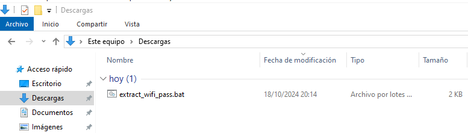
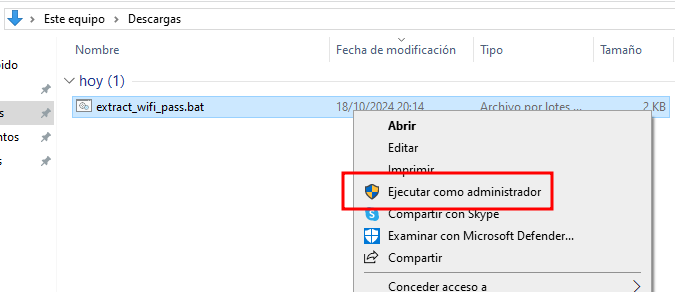
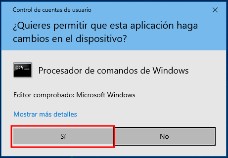
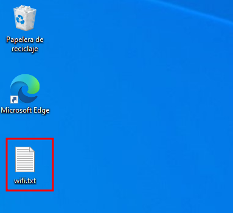
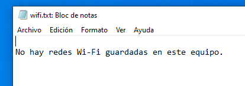
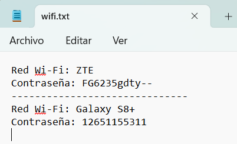

# extract_wifi_pass.bat

## Descripción

`extract_wifi_pass.bat` es un script para Windows que permite extraer y mostrar las contraseñas de las redes Wi-Fi guardadas en el sistema. El script hace uso de comandos internos de Windows para listar las redes Wi-Fi conocidas en la computadora y recuperar las contraseñas asociadas a cada una de ellas.

> ⚠️ **Advertencia:** Este script debe utilizarse con responsabilidad. Asegúrate de tener los permisos adecuados antes de usarlo en un sistema que no sea el tuyo. No utilices este script para acceder a redes sin autorización.

## Funcionalidad

El script realiza las siguientes acciones:
Extrae las contraseñas almacenadas y las guarda en un archivo `wifi.txt` en el Escritorio.

## Uso

1. Descarga el archivo `extract_wifi_pass.bat`.
   
   
   
2. Haz clic derecho sobre el archivo y selecciona "Ejecutar como administrador". Es necesario tener permisos de administrador para poder acceder a las configuraciones de las redes Wi-Fi.

   

3. Acepta el mensaje del Control de Cuentas de Usuario (UAC) que solicita permisos para ejecutar el script como administrador.

   

4. El script generará un archivo llamado `wifi.txt` en el Escritorio con la información de las redes Wi-Fi y sus contraseñas.

   

## Ejemplos

### Ejecución sin redes disponibles
Si no hay ninguna red Wi-Fi guardada en el sistema, el script indicará que no se encontraron redes disponibles.

   

### Ejecución con redes disponibles
Cuando hay redes Wi-Fi guardadas en el sistema, el archivo `wifi.txt` mostrará la información y contraseñas de cada red.

   

## Requisitos

- Sistema Operativo: Windows 7, 8, 10 o superior.
- Permisos de administrador en el sistema.

## Instrucciones de Ejecución

1. Clona el repositorio o descarga el archivo `extract_wifi_pass.bat` directamente:
   
   ```bash
   git clone https://github.com/tu_usuario/extract_wifi_pass.git
